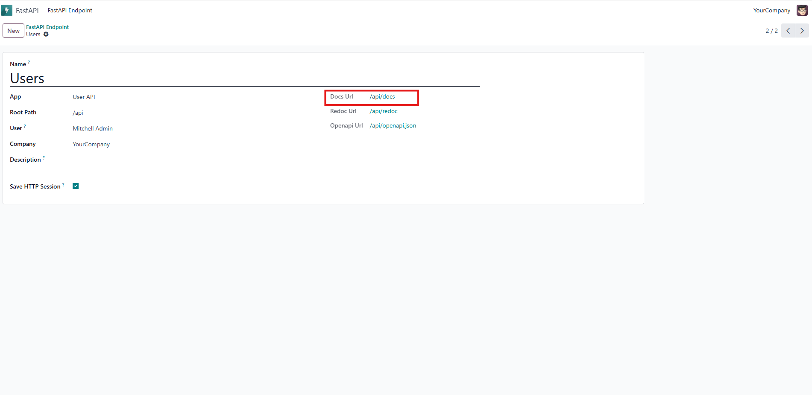
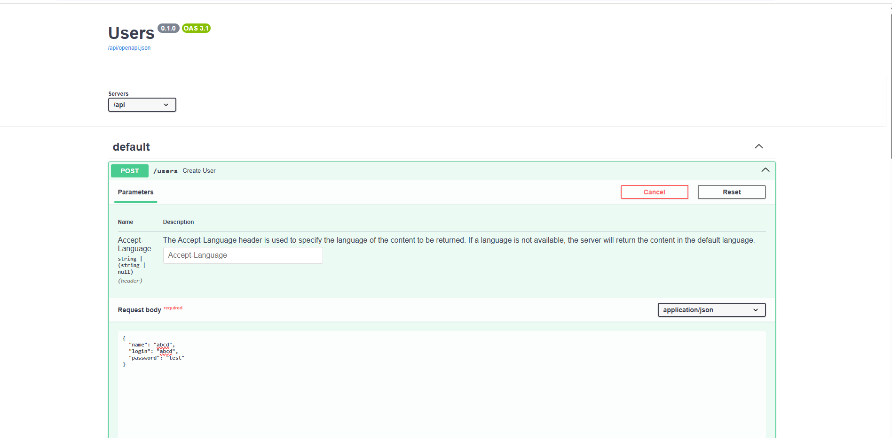

To create a user via the API, you can make a request from your system or
an API platform. You can also verify the endpoint by clicking the
**Docs** URL link, as shown in the image below.

Then, you can make a request as shown in the image below.

